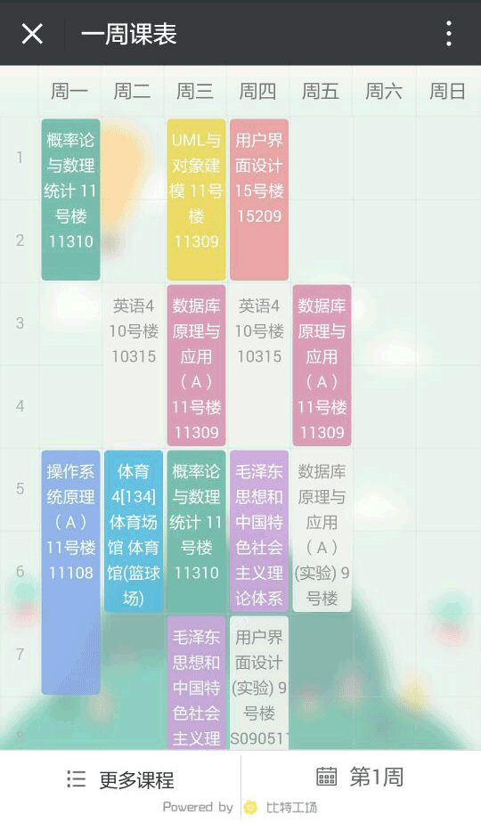
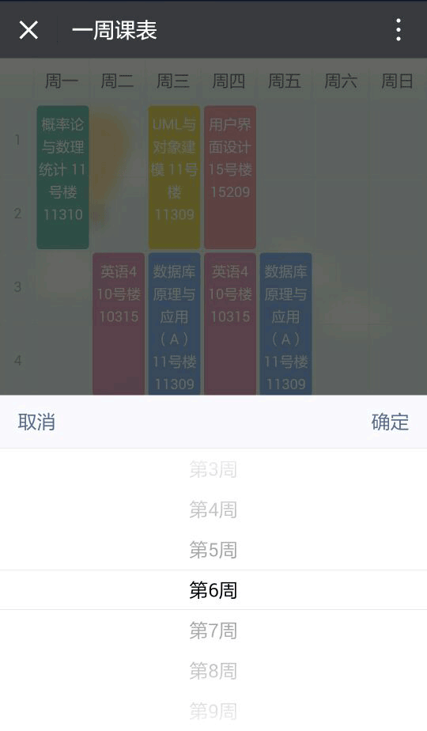
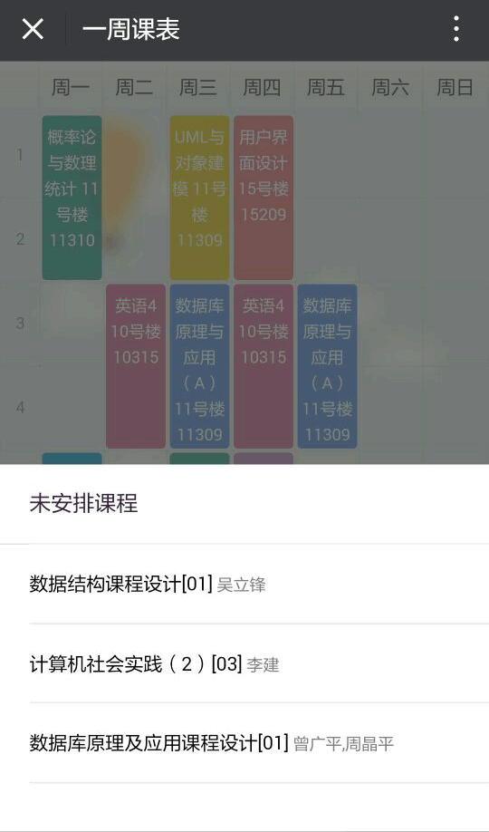
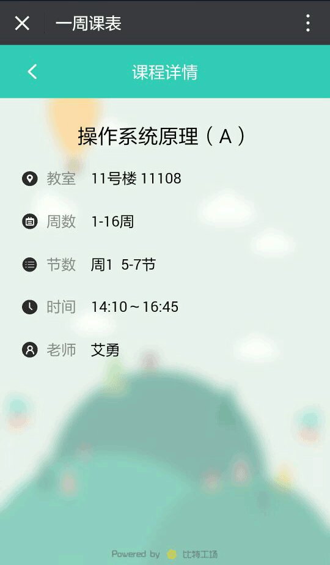

## 一周课表
> 一个类似于超级课程表的web版一周课表项目
> 技术栈：html css jquery
### 实现功能
- [x] 显示一周课表信息
- [x] 切换周次
- [x] 显示未安排时间地点的课程
- [x] 弹窗显示冲突课程
- [x] 显示课程详情
- [x] 处理单双周,调课,冲突,体育课时间等特殊情况
### 页面示例
#### 首页

#### 切换周次

#### 未安排课程

#### 课程详情
  

[一周课表预览](https://wechat.stuzone.com/iscuecer/lab_query/web/index.html?openid=oULq3uHTyplVHA-DOYr8kFgg5Ndg)
由于该项目仅用于移动端，所以请在手机或pc设备模拟器上查看效果